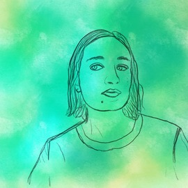

Barbara Metzler, PhD

  
  

I'm a Research Associate with the [Science of Cities and Regions group](https://www.turing.ac.uk/research/research-projects/science-cities-and-regions) at the Alan Turing Institute. I'm interested in people, data and foundation models - currently thinking about foundation models in GeoAI.

Recent projects as part of the Alan Turing Institute:
- [Are you smarter than a foundation model? (Online game)](https://are-you-smarter-than-a-foundational-model.vercel.app/)
- [DemoLand](https://urban-analytics-technology-platform.github.io/demoland-web/tyne_and_wear/)
- [EuroFab](https://eurofab-project.github.io/)

Before joining the Alan Turing Institute, I obtained my PhD at Imperial College London as part of the [Global Environmental Health Research Group](http://globalenvhealth.org/) and the [Pathways to Equitable Healthy Cities](http://equitablehealthycities.org/) collaboration. My PhD research focussed on characterising urban development with high-resolution satellite imagery and machine learning in Sub-Saharan Africa.

* * *
Download my CV [here](CV_2page_aug24.pdf).
  

* * *

  

### Selected publications

[Google scholar](https://scholar.google.com/citations?user=XLtnLLoAAAAJ&hl=en)

*A B Metzler*, R Nathvani, V Sharmanska et. al.. Phenotyping urban built and natural environments
with high-resolution satellite images and unsupervised deep learning. In Science of The Total
Environment (STOTEN), 2023. [https://doi.org/10.1016/j.scitotenv.2023.164794](https://doi.org/10.1016/j.scitotenv.2023.164794)

*A B Metzler*, R Nathvani, V Sharmanska et. al.. Capturing and characterizing the urban fabric
of sub-Saharan Africa with very high-resolution satellite imagery and unsupervised machine
learning. In American Association of Geographers (AAG) Annual Meeting, 2023.

E Muller, E Gemmell, I Choudhury, R Nathvani, *A B Metzler* et. al.. Mapping City-Wide
Perceptions of Neighbourhood Quality using Street View Images. In
https://arxiv.org/abs/2211.12139. 2022. [https://arxiv.org/abs/2211.12139](https://arxiv.org/abs/2211.12139)

R Nathvani, S N Clark, E Muller, A S Alli, J E Bennett, J Nimo, J B Moses, S Baah, *A B Metzler* et. al.. Characterization of urban environment and activity across space and time using street
images and deep learning in Accra. In Nature, Scientific Reports, Smart Cities special, 2022.
[https://doi.org/10.1038/s41598-022-24474-1](https://doi.org/10.1038/s41598-022-24474-1)

*A B Metzler*, R Nathvani, V Sharmanska et. al..Characterization of urban built and natural
environments with high-resolution satellite images and unsupervised deep learning. In Annual
Conference of the International Society for Environmental Epidemiology (ISEE), 2022.

R Nathvani, S N Clark, E Muller, A S Alli, J E Bennett, J Nimo, J B Moses, S Baah, *A B Metzler* et. al.. Spatiotemporal characterization of urban activity and environment with imagery and
deep learning. In Annual Conference of the International Society for Environmental Epidemiology
(ISEE), 2021.

T Burgess, *B Metzler*, A Ettlinger, et al.. Geometric Constraint Model and Mobility Graphs for
Building Utilization Intelligence. In International Conference on Indoor Positioning and Indoor
Navigation (IPIN), 2018.
